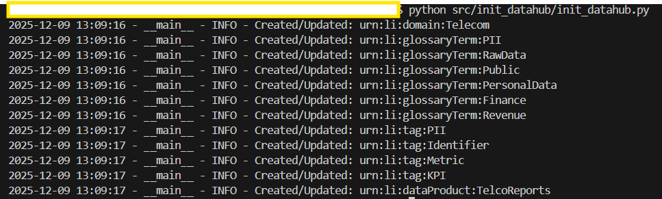
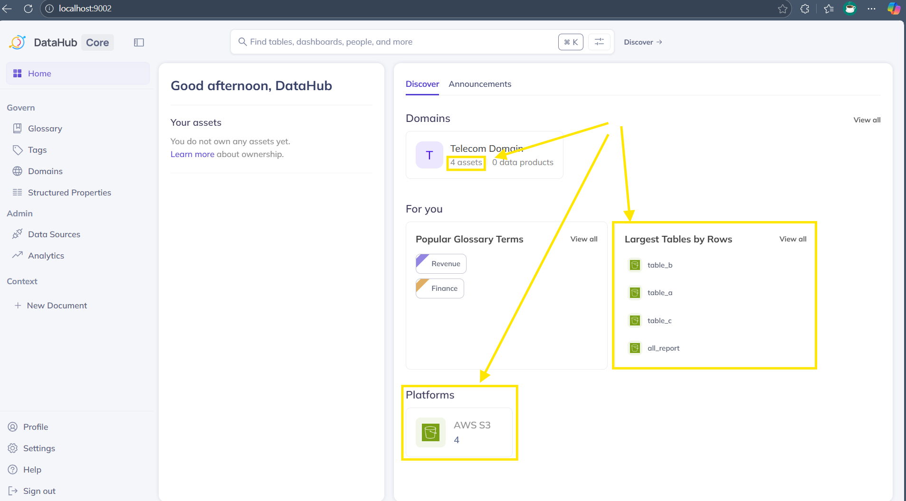
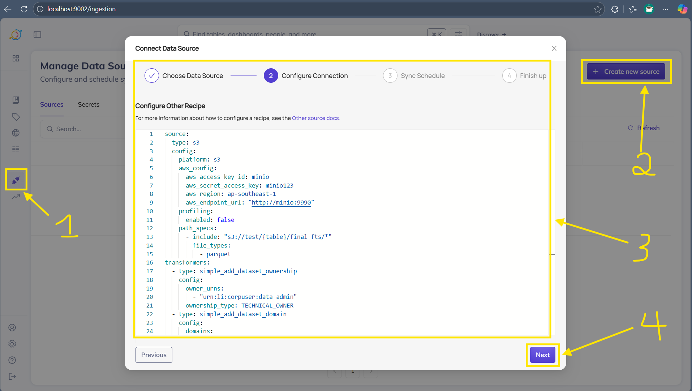
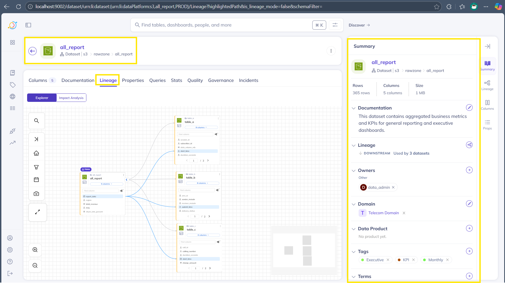

# Test_datahub

A minimal repository to start a local Apache DataHub stack and
ingest sample datasets. The document is concise, reproducible, and
structured for local development.

## Overview

- Purpose: Launch DataHub and import metadata from JSON or an
  S3-compatible store (MinIO).
- Contents:
  - docker-compose.yaml: DataHub and dependent services.
  - requirements.txt: Python dependencies.
  - src/: ingestion and initialization scripts.
  - dataset/: sample data layout.

## Ports (default mappings)

The compose file exposes these service ports by default. Each mapping
can be overridden via the corresponding environment variable.

- DataHub GMS (HTTP): 8080 -> 8080
- DataHub UI (React): 9002 -> <http://localhost:9002>
- Kafka (broker): 9092 -> 9092
- Zookeeper: 2181 -> 2181
- Elasticsearch: 9200 -> <http://localhost:9200>
- MySQL: 3306 -> 3306
- Neo4j HTTP / Bolt: 7474 -> <http://localhost:7474>, 7687 -> 7687
- Schema Registry: 8081 -> 8081
- MinIO (S3): 9990 -> <http://localhost:9990>

## Quick start

Open PowerShell or CMD on Windows and run:

1. Install Python dependencies:

```bash
   python -m pip install --upgrade pip
   pip install -r requirements.txt
```

2. Launch the stack:

```bash
   docker-compose up -d
```

Wait until healthchecks complete. DataHub UI is typically at <http://localhost:9002>

## Project layout

- docker-compose.yaml: orchestrates DataHub and services.
- requirements.txt: acryl-datahub extras for ingestion.
- src/init_datahub/: initialization helpers.
- src/import_by_json/: JSON metadata ingestion.
- src/import_by_s3/: S3/MinIO ingestion scripts and config.
- dataset/: sample dataset structure used by importers (.parquet folder).

## Basic usage examples

- 0, Create Domain, Glossary Terms, Tags, Data Product for DataHub:

```bash
  python src/init_datahub/init_datahub.py
```



- 1, Import JSON metadata:

```bash
  python src/import_by_json/import_json_metadata.py
```



- 2, Import data from S3/MinIO (Optional):

```bash
  python src/import_by_s3/import_data_to_datahub.py
```

or You can setup connect to S3:



- 3, Create lineage:

```bash
  python src/import_by_json/create_lineage.py
```



- 4, Check DataHub UI: <http://localhost:9002>

- 5, Delete dataset via DataHub CLI (soft delete by default), example:

```bash
  DATAHUB_GMS_URL=http://localhost:8080 \
   datahub delete --urn "urn:li:dataset:(urn:li:dataPlatform:s3,test/sms,PROD)" --force
```

or

```bash
export DATAHUB_GMS_URL=http://localhost:8080

datahub delete --urn "urn:li:dataset:(urn:li:dataPlatform:s3,all_report,PROD)" --hard --force
datahub delete --urn "urn:li:dataset:(urn:li:dataPlatform:s3,table_a,PROD)" --hard --force
datahub delete --urn "urn:li:dataset:(urn:li:dataPlatform:s3,table_b,PROD)" --hard --force
datahub delete --urn "urn:li:dataset:(urn:li:dataPlatform:s3,table_c,PROD)" --hard --force
```

## Coding Convention

Use `.editorconfig` to enforce consistent code style in VS Code.

## Ruff Linting

Configure linting rules in `.ruff.toml` for automated code checks.

## License

MIT
